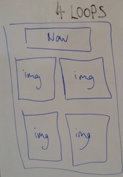
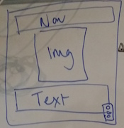
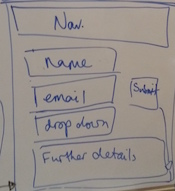

## What the blog is used for?

The blog describes Fourloop's experience of Founders and Coders during our 16 weeks. <a href="http://fourloops.github.io/FourLoopsBlog/">Link to gh-pages here.</a>

A user can expect to read about our experiences, find out information about us on our profile page and will also be able to contact us.

## Why are we making the blog?

We would like to document our time at Founders and Coders and present it in a way that is easy for others to view how we spent our time on the course.

## How are we going to do it?

We want to include:

* Easy access to a recent blog post

* A blog post archive

* A profile for each member

* A profile index

* Contact form

* A summary of what the blog is about

## Pages

The nav bar will be common to all pages and will contain links to the following pages

#### Home page

Will include:

* A summary of what Fourloops is about

* Partial content of a recent blog post with a link to it

* Image related to our group

Home page wireframe

#### Fourloops

Four pictures which each link to our profiles

fourloops page wireframe

###### Profiles

We intend to standardize the profiles to a template and only have a different image, text and links.

Profile page wireframe

#### Blog Archive

Four clickable images called Month 1, Month 2, Month 3, Month 4, which link to four clickable weeks and these link to the blog post.

Archive wireframe

###### Monthly pages

It will have the same layout as the blog Archive, with weeks 1 to 4 using the quadrants.

#### Contact

A form with input text-boxes for your name, email, and further details. Between email and further details we would like a drop down menu of the reason for contacting, with options of: designing a prototype, making an mvp or other enquiries.

Contact page wireframe

